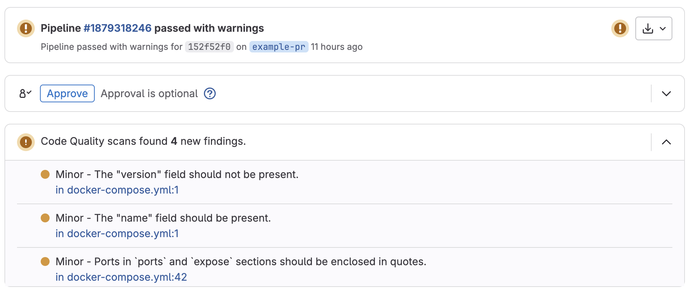

# DCLint Component for GitLab

[](https://gitlab.com/dclint/ci-component/-/releases)

This GitLab CI/CD component automates Docker Compose linting using
[DCLint](https://github.com/zavoloklom/docker-compose-linter).

It runs `dclint` and publishes a
[Code Quality Report](https://docs.gitlab.com/ci/testing/code_quality/#view-code-quality-results) compatible with GitLab
Merge Request UI.

> The source code is hosted on [GitLab](https://gitlab.com/dclint/ci-component). Although there is an automatic mirror
> of this repository on [GitHub](https://github.com/docker-compose-linter/gitlab-ci-component), all bug reports, feature
> requests, and merge requests should be submitted through GitLab.

## DCLint Features

- **Error Detection**: Identifies syntax errors and common issues in Docker Compose files.
- **Style Enforcement**: Enforces best practices and style guidelines for maintainable configurations.
- **Flexible Integration**: Can be used locally, in Docker, or integrated into CI/CD pipelines.
- **Configurable Rules**: Customize the linter's behavior and rules according to your project's needs.
- **Auto-fixable Rules**: Some rules include an auto-fix mode, allowing you to automatically format and correct certain
  issues in your files.
- **Comments Support**: After automated sorting and fixing, comments remain in the correct place, ensuring no important
  information is lost during the formatting process.
- **Anchor Support:** Supports YAML anchors for shared configuration sections, with some limitations.

## Usage Example

```yml
include:
  - component: $CI_SERVER_FQDN/dclint/ci-component/dclint@v1.0.0
```

> 💡 Requires GitLab 16.8 or later

### Merge Request Widget Example

DCLint highlights issues directly in the GitLab MR widget using Codequality reports.

{height=300px}

## Inputs

| Name            | Type      | Default                                 | Description                                    |
| --------------- | --------- | --------------------------------------- | ---------------------------------------------- |
| `target`        | `string`  | `.`                                     | DCLint Target path to lint                     |
| `options`       | `string`  | `""`                                    | DCLint Extra CLI flags (e.g. `--recursive`)    |
| `formatter`     | `string`  | `codeclimate`                           | DCLint Formatter for output                    |
| `version`       | `string`  | `3.0.0`                                 | DCLint Version (used as `${version}-alpine`)   |
| `job_prefix`    | `string`  | `codequality-dclint`                    | GitLab CI Job prefix                           |
| `job_stage`     | `string`  | `.pre`                                  | GitLab CI Pipeline stage                       |
| `rules`         | `array`   | `- if: '$CI_PIPELINE_SOURCE == "push"'` | GitLab CI Rules                                |
| `tags`          | `array`   | `[]`                                    | Gitlab CI Runner tags                          |
| `allow_failure` | `boolean` | `false`                                 | Allow job to fail without failing the pipeline |

## Documentation

See [DCLint Documentation](https://github.com/zavoloklom/docker-compose-linter).

## Contributing

Merge requests are welcome. For major changes, please open an issue first to discuss what you would like to change.

If you'd like to contribute to this project, please read through the [CONTRIBUTING.md](./CONTRIBUTING.md) file.

Please note that this project is released with a [Contributor Code of Conduct](./CODE_OF_CONDUCT.md). By participating
in this project, you agree to abide by its terms.

## Versioning and Changelog

This repository itself is versioned using [`semantic-release`](https://github.com/semantic-release/semantic-release).
All changes are categorized and released based on [Conventional Commits](https://www.conventionalcommits.org/).

The changelog is automatically generated based on
[semantic-release](https://github.com/semantic-release/semantic-release) and
[conventional commits](https://www.conventionalcommits.org/en/v1.0.0/).

See the [CHANGELOG.md](./CHANGELOG.md) file for detailed lists of changes for each version.

### Dependency Updates

- The versions of `dclint` are **checked weekly** via a scheduled pipeline and used as default value.
- If a new version is available, a **merge request is automatically created** to update all relevant files.

## License

This project is licensed under the MIT License. See the [LICENSE](./LICENSE) file for more information.

## Contacts and Support

If you find this repository helpful, kindly consider showing your appreciation by giving it a star ⭐.

If you have any questions or suggestions, feel free to reach out:

- **Email**: [s.kupletsky@gmail.com](mailto:s.kupletsky@gmail.com)
- **Х/Twitter**: [zavoloklom](https://x.com/zavoloklom)
- **Instagram**: [zavoloklom](https://www.instagram.com/zavoloklom/)
- **GitHub**: [zavoloklom](https://github.com/zavoloklom)

Also, you can support this project with a one-time donation or becoming a sponsor:

[](https://www.paypal.com/donate/?hosted_button_id=J8KS3RUFKSHDL)
[](https://www.patreon.com/c/zavoloklom)
[](https://github.com/sponsors/docker-compose-linter)
[](https://opencollective.com/dclint)
